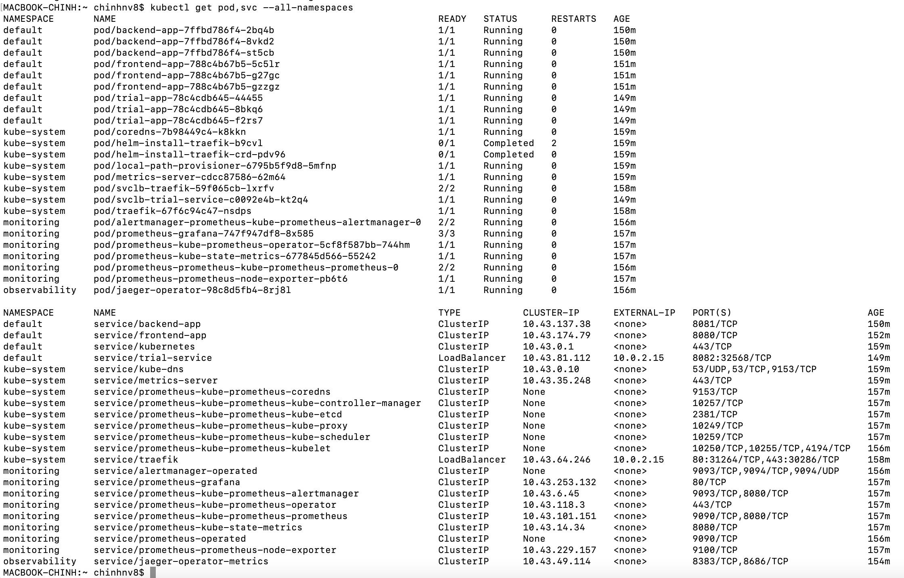

**Note:** For the screenshots, you can store all of your answer images in the `answer-img` directory.

## Verify the monitoring installation

*TODO:* run `kubectl` command to show the running pods and services for all components. Take a screenshot of the output and include it here to verify the installation

## Setup the Jaeger and Prometheus source
*TODO:* Expose Grafana to the internet and then setup Prometheus as a data source. Provide a screenshot of the home page after logging into Grafana.

## Create a Basic Dashboard
*TODO:* Create a dashboard in Grafana that shows Prometheus as a source. Take a screenshot and include it here.

## Describe SLO/SLI
*TODO:* Describe, in your own words, what the SLIs are, based on an SLO of *monthly uptime* and *request response time*.
Monthly Uptime SLI: this measures the percentage of time the service is operational and available over a month. 
Request Response Time SLI: This measures the time taken to respond to a request. It's typically calculated as the average or percentile of response times over a given period, ensuring that the service meets the expected perfomance levels.

## Creating SLI metrics.
*TODO:* It is important to know why we want to measure certain metrics for our customer. Describe in detail 5 metrics to measure these SLIs. 

Availability: This metric tracks the percentage of time the service is up and running. It is crucial for understanding the reliability of the service and directly relates to the monthly uptime SLI.
 
Downtime Duration: Measures the total time the service is unavailable within a month. This helps identify periods of unavailability and their impact on the monthly uptime SLI.
 
Error Rate: Calculates the percentage of failed requests compared to total requests. A high error rate can affect both uptime and response time, indicating issues in service reliability.
 
Average Response Time: Measures the average time taken to respond to requests. This metric is essential for assessing the request response time SLI and ensuring the service meets performance expectations.
 
95th Percentile Response Time: Focuses on the response time for the slowest 5% of requests. This metric helps identify outliers and ensures that most requests are handled within acceptable time limits, providing a more comprehensive view of performance.

## Create a Dashboard to measure our SLIs.
*TODO:* Create a dashboard to measure the uptime of the frontend and backend services We will also want to measure to measure 40x and 50x errors. Create a dashboard that show these values over a 24 hour period and take a screenshot.

## Tracing our Flask App
*TODO:*  We will create a Jaeger span to measure the processes on the backend. Once you fill in the span, provide a screenshot of it here. Also provide a (screenshot) sample Python file containing a trace and span code used to perform Jaeger traces on the backend service.

## Jaeger in Dashboards
*TODO:* Now that the trace is running, let's add the metric to our current Grafana dashboard. Once this is completed, provide a screenshot of it here.

## Report Error
*TODO:* Using the template below, write a trouble ticket for the developers, to explain the errors that you are seeing (400, 500, latency) and to let them know the file that is causing the issue also include a screenshot of the tracer span to demonstrate how we can user a tracer to locate errors easily.

TROUBLE TICKET

Name:

Date:

Subject:

Affected Area:

Severity:

Description:

## Creating SLIs and SLOs
*TODO:* We want to create an SLO guaranteeing that our application has a 99.95% uptime per month. Name four SLIs that you would use to measure the success of this SLO.

## Building KPIs for our plan
*TODO*: Now that we have our SLIs and SLOs, create a list of 2-3 KPIs to accurately measure these metrics as well as a description of why those KPIs were chosen. We will make a dashboard for this, but first write them down here.

## Final Dashboard
*TODO*: Create a Dashboard containing graphs that capture all the metrics of your KPIs and adequately representing your SLIs and SLOs. Include a screenshot of the dashboard here, and write a text description of what graphs are represented in the dashboard.  
